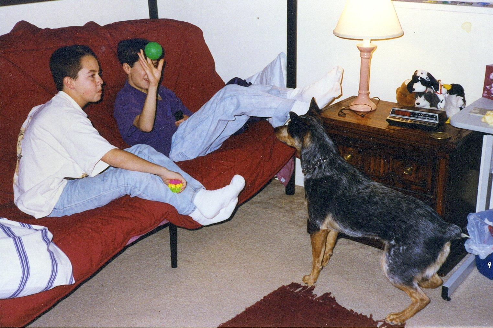
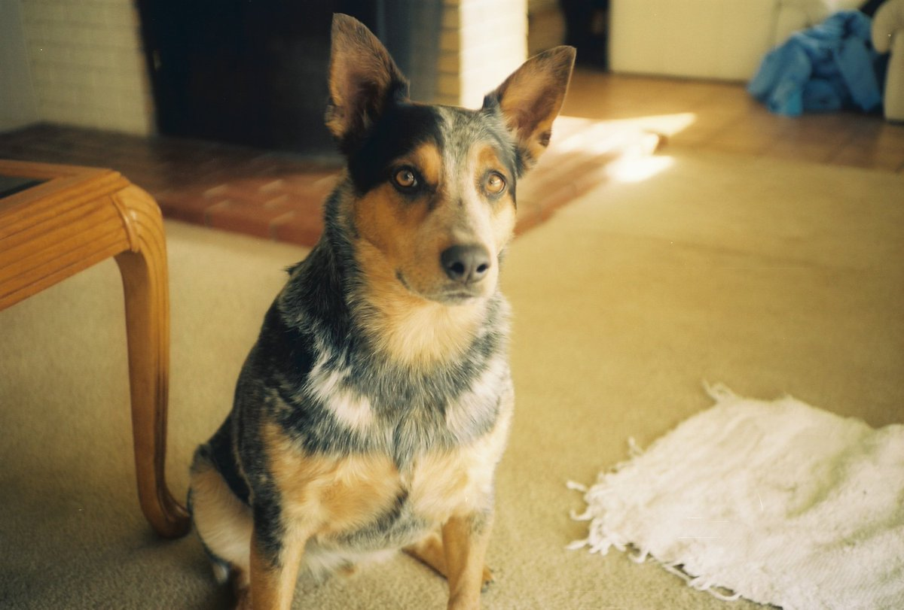
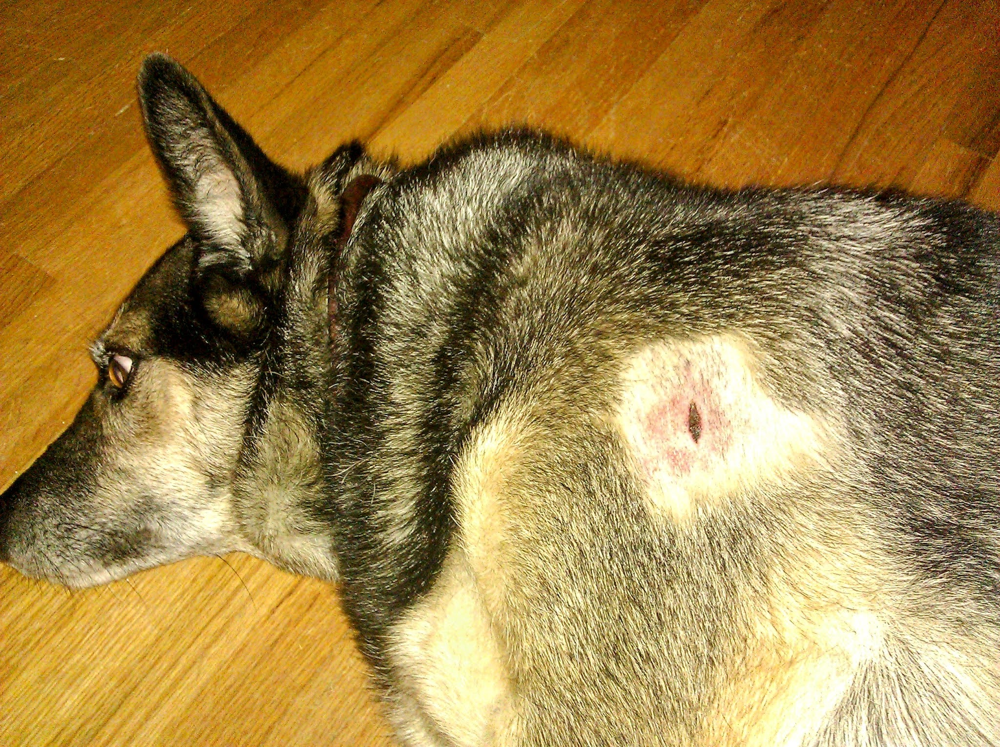
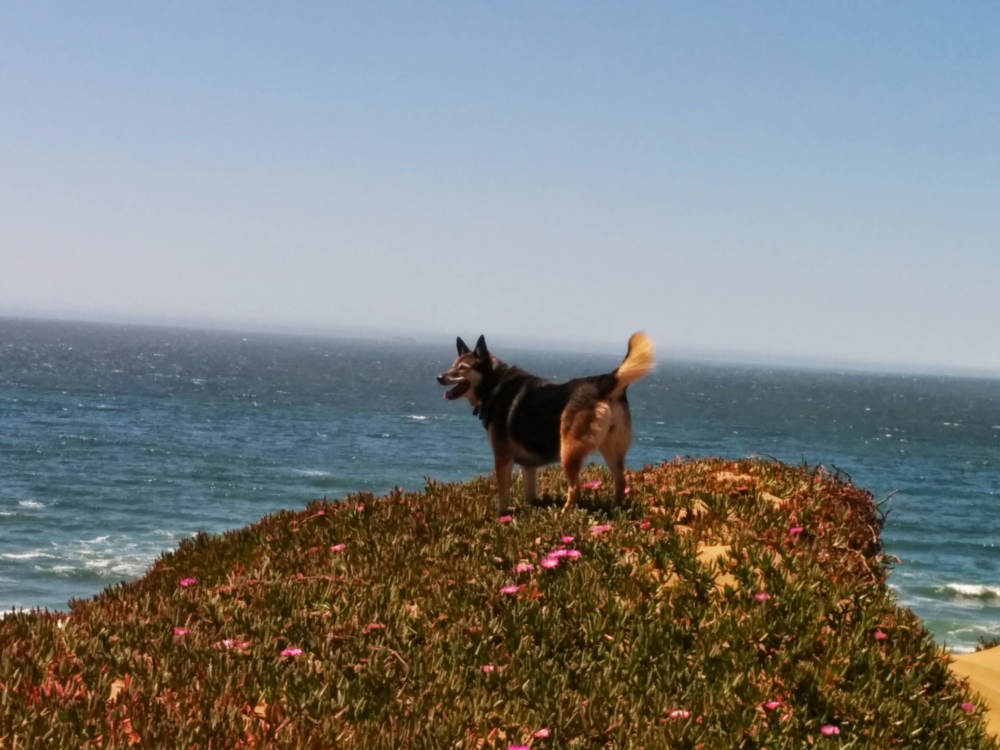
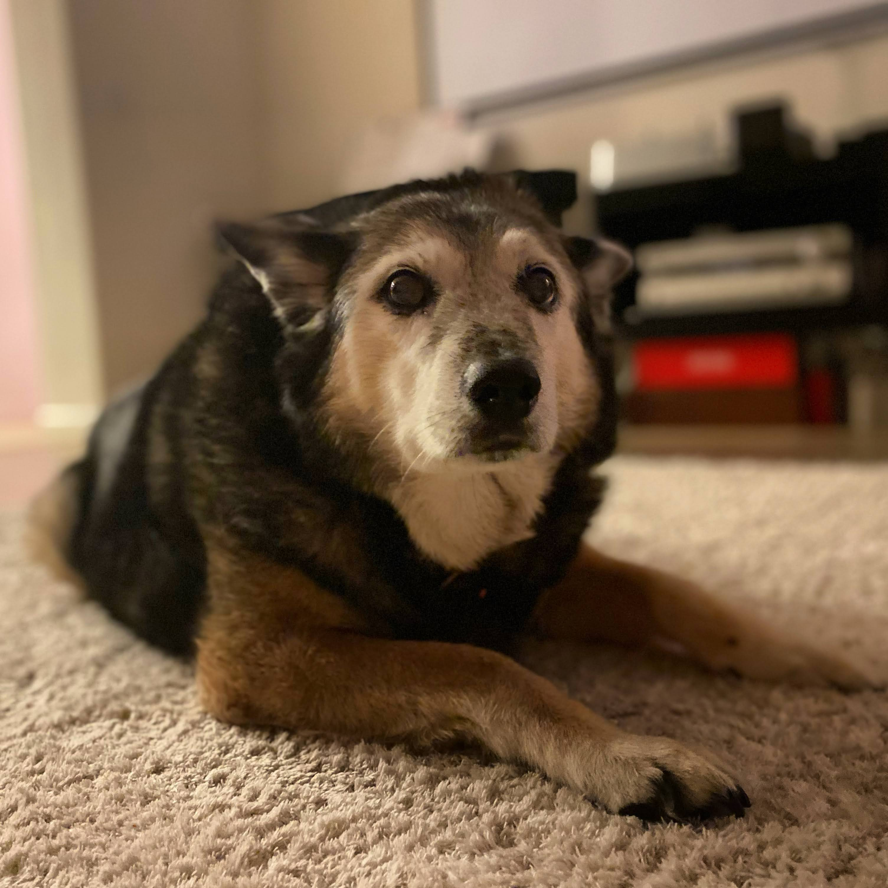
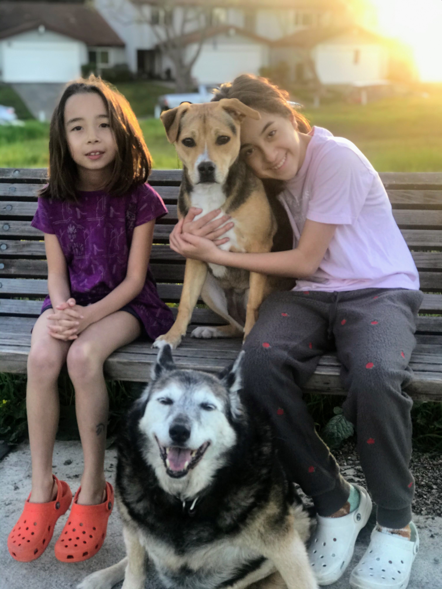
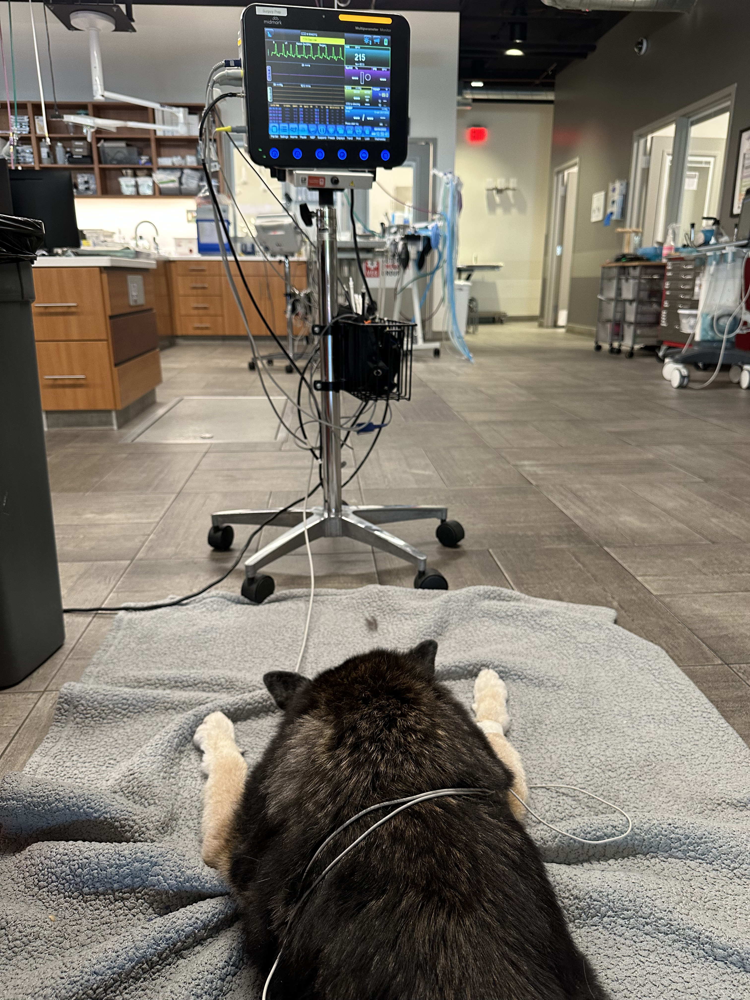

---
tags:
  - blog
  - unpublished
---

# The Journey with Rosie

| Metadata   | Value                                    |
| ---------- | ---------------------------------------- |
| Date       | 2025-09-21                               |
| Categories | dogs, loss, death, grief, healing, draft |

---

*SUMMARY:  A story about growing up with dogs, grief, loss and healing.*

## First meeting Rosie

<figure>

<figcaption>Rosie as an 8 week old puppy.</figcaption>
</figure>

Rosie was a German Shepard and Australian Shepard mix.  I first saw her at a PetSmart in Albuquerque, New Mexico -- I don't remember why we were there, but as one does you play with the puppies when the store has an adoption event and then happenstance leaves you with a new family member...

This is a story of a "chance" encounter,  with the adoption and happening to see Rosie fitting with my romantic notion around the adoption of a new pet. That is, sometimes serendipity brings you together, things click into place, and fate sends you a new companion that you were meant to be with...  Not all of our pets have come to us this way, but Rosie's impact on my life was deep and impactful, hopefully something that won't fade any time soon.

So it seems fitting that fate chanced a meeting between us.

## Growing up with dogs

<figure>

<figcaption>Silver (a blue heeler) catching a ball.</figcaption>
</figure>

To better understand the journey it's helpful to talk a little bit about how I grew up... I've always grown up around dogs and being an only child, dogs were occasionally the only other soul that was around. I was born in small oil town in New Mexico where we had a few dogs that I barely remember, but I knew they were around through stories from my parents and wisps of memory. The first dog I really remember was Tiger, he was a brindle striped Terrier that was already pretty old by the time he appears in my core memories.  He passed at a very old age when I was at school, and we buried him in the foothills of the Albuquerque mountains-- where he loved to go on hikes. Tiger's passing hurt, but I don't remember it being all that lasting.  I remember being upset, and wanting to express my rage with my father by literally screaming at the sky after we laid him to rest, but whatever I felt passed pretty quickly.

The next dogs growing up where Bradford and Silver-- Silver was a birthday present, adopted when I was about 10 years old from a random litter somewhere outside of Albuquerque.  Silver was the first dog were I had a large part in his upbringing and his care.  I have a vivid memory of potty training Silver when he was an barely an 8 week old puppy, and I was a kid, but I remember waking up in the middle of the night and wondering where he was, only to wander out into the hallway of the house and find him about to go "number 2" on the carpet.  I ran to grab him and whisked him outside to (hopefully) reinforce his potty training.

<figure>

<figcaption>A dapper Blue Heeler named Silver.</figcaption>
</figure>

Despite this though I was still just a kid who was occasionally a shithead, and as a kid I was not always as kind to our dogs as I should have been.  Sometimes I found titillation in antagonizing them and while I never did anything that would harm them, it's still not something I'm proud of today.  This is important though, because it was a motivation behind a desire to do better as an adult.  At some point when I was growing up I decided that when I adopted a dog as an adult, I was going to make sure that dog lived the best life I could give them, while still respecting their nature as dog.

## Rosie was my own

And so, Rosie was the first dog that was really *mine*.  When we adopted her I was a few years into my first real job, we lived in an apartment, but it was an otherwise ideal time when I had the money and the time to raise and train a dog properly.  I could set right all the things right that went wrong when I was younger.  I was the "architect" of Rosie's training, upbringing and care.

Despite my desires to engineer the perfect dog, Rosie was her own dog with her own desires and unique challenges.  She was intelligent, strong willed and proud, all of which made life with her rewarding and challenging in ways that I didn't expect.

In many ways, she was my first "child" -- I am not overly found of the term "fur baby" but at times it does aptly describe the responsibilities of a pet owner around the upbringing, care, and feeding of another life.  I know for certain that some of my parenting style is derived from my experience with raising dogs... (which is perhaps a bit unfortunate for my human children).

## A dog is a dog, but also... family

Following on that note, I believe that things like animals and people have a certain essential nature.  That means there's core behaviors and characteristics that don't (or can't) change, and being aware of them helps build empathy and understanding.  So, terms like fur-baby just seem to anthropomorphize dogs in ways that mask and ignore this nature.

Though even if you keep this perspective, that doesn't stop a deep bond from forming.  From time to time I've mused on how odd it is that this bond is reserved for a small subset of animals in our society, and other animals are treated with either indifference or cruelty.  The practice shows how malleable our compassion is, but it also shows its deference towards utility and mutual benefit.  This is a digression though, and nevertheless Rosie felt like family.

The relationship that existed between myself, Rosie and the family had many facets.  For example, we did lots of training at a training facility in Albuquerque called ACOMA.  This taught me a lot about how to train and raise dogs.  ACOMA emphasized the use of positive and negative reinforcement.  For dogs that responded to just positive enforcement, that was all that was used, but for most dogs and combination of positive and (some) negative reinforcement was needed.  ACOMA also taught me about the limits of dogs with respect to how they learn and how to recognize when a dog's ability to learn was "saturated".

Overall I think these experiences helped to provide structure around how our relationship developed.  Like many things in life, developing a deeper understanding for how something works can often make for a richer and more empathetic experience.  Of course I didn't always live up to this day to day, but hopefully we were better off for it in the long run.

## Where did we go from here?

So where did we go from here?  Rosie was part of my life for more than 16 years, she saw the start of my career, my marriage, the birth of both of my children, moving from New Mexico to California and the loss of loved ones.  All these major milestones in my life were enriched or supported by her presence and love.  And yet, after her passing, I really struggled with how to move forward despite all the positive impact.  Questions like "What all this worth it?" and the like swirled around...  I'll discuss her passing more later, but this story is really about her life, her impact on me, and how I tried to come terms with her passing and just what that meant in the context of grief and choosing to move forward.

## Snapshots of Rosie's life

What follows are some snapshots of Rosie's life, to hopefully add some color to what she liked and how she lived.

### Agility training

<figure>

<figcaption>Rosie and I did agility training at ACOMA for about a year, though she was never super fast she trained pretty well, overall I think she enjoyed the mental challenge and the exercise.</figcaption>
</figure>

### Attack by loose dogs

<figure>

<figcaption>
Rosie was attacked by some loose dogs in our neighborhood in Albuquerque, I was able to scare off the dogs by screaming like a deranged lunatic, I'm glad this worked, but was definitely a scenario that could've turned out differently if the dogs hadn't been scared (a realization I had only in hindsight).
</figcaption>
</figure>

### Hiking & coyotes

<figure>

<figcaption>
Like most dogs, Rosie loved hiking, both in New Mexico and in California.  One of the few times I heard Rosie express fear was when we were hiking in California early in the morning and we had a few coyotes start to follow us, luckily they weren't interested in us for very long and eventually went their own way.
</figcaption>
</figure>

### Coming to California

<figure>

<figcaption>
Rosie came with us to California when I got my first job here with her dog sibling Nell, she adapted well to life here, but our living situation forced us to send Nell to live with my parents.  A few years later we moved into a house where we could have more dogs again, but by that time Nell had fully integrated into my parents house, so she stayed in New Mexico.  So, Rosie was our lone dog for a while with our two cats.
</figcaption>
</figure>

### Getting old(er)

<figure>

<figcaption>
After coming to California, I really struggled to find a vet that I liked, most of the vets in our area seemed accustomed to serving more affluent clientele, and it showed in their practices and pricing.  We eventually found a good vet in Livermore, but it meant a fair amount of driving just to go to the vet.  The drive is routine now, but I remember coming back from a vet visit after learning that Rosie was diagnosed with Cushing Disease and suddenly realizing that this was beginning of the end of my time with her.  It was still some 5 years before she would pass, but it hit really hard at that time.
</figcaption>
</figure>

### Adopting Ariel

<figure>

<figcaption>
We adopted Ariel as a reward for my older daughter doing well in school and hopefully as something that would teach her some responsibility... she did well in school but didn't end up doing much to raise and train Ariel...  Ariel, being who she is, was enamored with Rosie, and it was unfortunate that we adopted her so late in Rosie's life because they never got to bond much.  I know Rosie cared for Ariel, but Rosie was an old lady, and her treatment of her definitely showed that-- she wasn't (usually) mean, but definitely not as friendly as she could've been 😅 ~
</figcaption>
</figure>

### Emergency vet

<figure>

<figcaption>
All things considered, Rosie's diagnosis with Cushings Disease ended up not being the death knell that I thought it was since we were able to manage her symptoms with medication for a long time.  The real decline seemed to start when she forgot that she was old and decided to jump out of the car and tore a ligament in her back knee.  I'd been using a ramp for her for a few years to get in and out of the car, but despite her experience with dog agility, she still wanted to believe that she could jump in and out herself.  The weakness in her back legs betray her though and she ended up with a tear in her knee joint.  Though unrelated to the Cushings this event marked the beginning of a decline which ended with an "attack" one night that looked a lot like a seizure.  After visiting the doctor, we learned that her Cushings had advanced significantly, at which point she largely stopped eating and drinking, and was no longer able to walk around without a lot of assistance.
</figcaption>
</figure>

## Passing

All things considered, I don't have many regrets with respect to Rosie's life.  There are certainly things I wish I'd done differently, in particular I probably should have arranged better care for her when she was old.  There were a few scenarios where we had to leave her at home when she was old that probably would've been better handled by hiring professional care (or enlisting the help of a trusted friend), even for short stints.  She ended up being fine in those scenarios, but it was definitely a roll of the dice I shouldn't have taken.

That said, Rosie's passing started me down a path that I didn't know was going to be so hard, or take so long.  I've been fortunate in my life to not have to directly deal with much loss.  I've experienced loss indirectly, and supported others through loss, but Rosie was a lesson in directly dealing with loss I don't think I was prepared for... I've heard stories of people about literally "wanting to go back in time", about not wanting to live in your present reality anymore because the person (or dog) that you love is no longer there.  I experienced this viscerally with Rosie.

Then the pain of that loss becomes itself something I wanted to live inside because it felt like the only thing I had left of her.  I felt like as long as I was in pain that I still cared, and I didn't want to not be in pain and then feel like I didn't care for her anymore.  This manifested in scenarios which (in hindsight) where silly where I was desperately looking for some of Rosie's hair around the house after she had passed because I wanted a way to be reminded of what she felt and smelled like (and I had forgotten to ask the doctor to preserve a clipping after her final vet visit).  There was rich irony in that scenario, since I spent most of her life being annoyed by all the hair, but there I was after the end of her life wanting to just find some of it to keep as a memento.

The pain subsided, and Ariel and I gradually got used to our new normal without Rosie.  The day-to-day with Ariel was easy, Ariel's only real challenge was her allergies and her penchant for wanting to sleep under the covers and right next to you.  This new normal was slow and easy, which was definitely what I needed for a while.

## Lessons

A small lesson is perhaps that experiencing and learning about grief can come from relationships where you might not expect it.  I knew Rosie was important, but the surprise was learning just how deeply important she was after she was gone.  Which serves as a reminder to enjoy and cherish the time that you have, making sure that you respect the essential nature of the relationship for what it is.

Perhaps a practical lesson I experienced was learning how to rationalize or think about the financing of care for older pets.  Older pets can be expensive and that can build regret around the amount of time you were able to give them or around your ability to pay for their care, but you also have to weigh that against the richness of the life they lived and how much impact that care will have on both their quality of life, and their potential for recovery.  All that also has to be weighed against the practical limits of your finances and realities of vets and animal care.

But, back to the larger point... I think the biggest lesson for me was about how to move forward, death is inevitable, being able to process the grief and still find the overwhelming net positive of the relationship was the important learning.  My life was infinitely improved by Rosie's presence, I wouldn't have it any other way, but unfortunately that means you eventually have to pay the "cost" of dealing with the grief.  Recognizing that and being able to choose to do it again was when I think I really learned and grew from the experience of her loss.

## Grief and acceptance

<figure>

<figcaption>
Nia's adoption photos.
</figcaption>
</figure>

Fast forward to about a year and a half after Rosie's passing and I received an email from a small dog boarding business that we'd used previously, this was a small business run out of a house (in Castro Valley, California).  This message was sharing that a client of theirs had a foster puppy up for adoption.  I was struck by how much this dog reminded me of Rosie.  My romantic notions around pet adoption kicked in and I felt I had to reach out.

Complications arose in this situation because I hadn't yet realized I *wasn't done grieving for Rosie*, and I started to entertain the idea that maybe this *was* Rosie, reincarnated and trying to make her way back to me.  I felt compelled to reach out, even though it really wasn't a good time for us to entertain taking on a new pet.  We happened to be preparing to leave for a big trip to Hawaii and we would've had a terrible time trying to figure out how to board a brand new dog.  We decided to go a bit spur of the moment, so my older daughter wasn't able to attend.

The dog's name was Nia, and our first meeting... did not go well, despite my exceptionally romantic notions of the situation, reality showed me that Nia was her own entity, with a unique set of quirks and challenges.  In Nia's case, she was very afraid of strangers (and men in particular), and overall did not demonstrate much interest in us or Ariel.  Ariel and Nia played a bit, but it didn't help that Ariel was also stressed out by being in Oakland.  Ariel is sound sensitive (very much a pandemic dog), so she never had much of a chance to acclimate to noisy city environments.

Given that the meeting didn't go well, and our impending travel, I just decided to say no, and hoped that Nia would find a good family in the interim.  Someone that understood shepherds and could give her the time and space she needed.  This really seemed to complete the final stage of grief, where I finally accepted that Rosie was gone, that this new dog wasn't her, and that I need to move forward.

## Healing and moving forward

<figure>

<figcaption>
Our second time meeting Nia.
</figcaption>
</figure>

After I said no, we went on our trip to Hawaii and had a great time.  It was wonderfully relaxing and was our last big family vacation before my daughter went off to college in the fall.  However, as it turns out, there are not many people, even in the Bay Area, that want to take on a dog with "stranger danger".  People want puppies, or they want dogs that are easy, or at least dogs that are going to show affection pretty quickly.  But as I would learn, shy dogs have a lot to offer too, it just takes a bit of time to gain their trust and build up a healthy relationship.

Our second meeting with Nia came after I saw from her foster's Instagram that she was still up for adoption two months later.  Her foster reached out to us and asked if we'd be willing to meet Nia again.  We decided to have another meeting and this time the whole family went.  To say things went better was an understatement.  Nia was still scared of me and my wife, but she immediately bonded with my younger daughter, and took pretty well to my older daughter.  So we decided to give her a chance, since she would at least get along with one person in the family.

Nia took time and effort, it was a full week before she was even remotely acclimated to me.  She was much quicker with my daughters and my wife... I had to be careful not to engage with her until she was ready.  Over time, she learned that I wasn't a threat and she learned to trust me.  To be honest, I wasn't fully ready to move on, Ariel and I had settled into life without Rosie, and I was afraid of the complications that new dog would bring to the relative stability of our life.  My wife helped me process and deal with this fear so we could commit to giving Nia a proper chance to integrate into the family.

I'm wonderfully grateful for this, because I could not be more in love with Nia.  Wishing that she would be just another Rosie was really selling short the experience of living with this new dog.  Nia couldn't be more different than Rosie, there's plenty of behaviors and tendencies that are common to all German Shepherds, but she's a super affectionate, goofy and happy ball of fluff that's hard to be mad at when she does something bad.  As our relationship has improved it's hard to express how much I enjoy having her in our life.

## Final thoughts

In writing this story, I struggled with how I was going to wrap this up and close things out, after Rosie passed I felt like I wanted to write some things down just to work through my thoughts, but I didn't really have a clear direction or narrative, so the "story" was really secondary to the processing.  That said, I hope if others read this that there's something useful here about how grief, loss and love are all intertwined.  Or perhaps by sharing this story, it will help others to see how I processed the loss, and get perspective on how long healing takes.  I realize it's not spelled out in the story, but I started writing this about 2 years ago in early 2024, Rosie passed in September of 2023, so now in the second half of 2026 I'm finally able to wrap up the story.

So what does wrapping up mean?  I think it means that I've been able to heal from the loss, and decide that I'm not going to stop exploring new relationships with future dogs (and other pets) that we may encounter.  I think I may be more guarded about how I allocate my emotional bandwidth, but I don't want the threat of loss and grief to starve me and my family from the joy and enrichment of these experiences.  More generally, the looming of grief and loss is always going to be there and it feels silly (to me) to live a life where you avoid experiences just because of that fear.  I hope that I will continue to have the emotional capacity and strength to keep having these relationships and experiences.

More importantly, Rosie, I will eternally cherish our time together, and I love  you always and forever.

